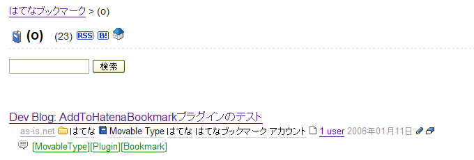

# AddToHatenaBookmarkプラグイン

エントリーを公開したときに、そのエントリーをはてなブックマークにポストするプラグイン。Movable Type 3.2以降(日本語版)でしか動作しません。また、はてなのアカウントが必要です。

## 更新履歴

 * 0.01(2006/01/11):
   * 公開。
 * 0.02(2006/01/14):
   * ブックマークのタイトルおよびタグの設定をEditURIへのupdateEntryで行うようにした。これにより、はてなブックマークがタイトルの自動取得に失敗した場合や、エントリーのタイトルやタグへの変更を行った場合にも、正しくブックマークに反映されるようになった。
 * 0.03(2006/12/05):
   * Movable Type 3.3以降のタグ機能で付けたタグをはてなブックマークのタグとして自動的に登録するようにした。

## 概要

このプラグインは、公開状態のエントリーを更新したり、新規に公開状態のエントリーを追加したときに、そのエントリーをはてなブックマークの自分のブックマークに追加するものです。

イマイチ用途が分かりにくいかもしれませんが、この作業をマニュアルでやっている人もいるようです。自分のブログをはてなブックマークで宣伝できるという一次的なメリットに加え、みんなでこれをやれば、はてなブックマークの検索機能をブログ検索機能として利用できるという二次的なメリットもありそうです(つーか、3ユーザがブックマークしないとダメか?)。

## 使い方

プラグインをインストールするには、上記アーカイブに含まれるAddToHatenaBookmark.plをMovable Typeのpluginsディレクトリにコピーしてください。

次に各ブログの「プラグインの設定」画面を開き、AddToHatenaBookmarkプラグインの「設定を表示」をクリックします。すると、ブックマークするはてなアカウントを設定する画面が表示されますから、ユーザ名とパスワードを入力し、「変更を保存」をクリックして保存しておきます。

以上でインストールと設定は終了です。

以降は通常通りエントリーを作成して公開状態で保存するたびに、そのエントリーを指定したはてなアカウントのブックマークに追加してくれます。

のように通常通りエントリーを公開すると、下のようにブックマークに登録してくれます。

すでにブックマークに登録済みの場合には何も起こりません(正確にはAddToHatenaBookmarkプラグインはAtomPPを使ってブックマークエントリーをポストしようとしますが、はてなブックマークは無視します)。

## ちょっと進んだ使い方

エントリーのタグ欄に入力された内容は、自動的にブックマークへのタグとして認識されます。

エントリーのキーワード欄に入力された内容は、自動的にブックマークへのタグとして認識されます。

キーワード欄の解釈方法は[Tagwire_Plugin Tagwireプラグイン]と共通です。ブラケット[]、シングルクォート・ダブルクォートで囲まれた文字列は一個のタグとして認識します。また、「;,|」は区切り文字として機能します。キーワード欄に「;,|」が含まれない場合には空白文字が区切り文字として機能します。

下記の例はすべて「Movable Type」と「Plugin」という二個のタグとして認識します。

    "Movable Type" Plugin
    Movable Type, Plugin
    Movable Type|Plugin|
    [Movable Type][Plugin]

また、以下の例は「MT」と「Plugin」という二個のタグとして認識します。

    MT Plugin

以下の例は、MovableType, Plugin, Bookmarkという3つのタグを登録するものです。

のようにキーワード欄に設定してエントリーを公開すると、下のようにタグ付きでブックマークに登録してくれます。

また、日本語のタグをキーワード欄に入力したときに、正常にブックマークされず、ログに以下のように表示されることがあります。

    Hatena request failed: Error on POST http://b.hatena.ne.jp/atom/post: 500 Wide character in syswrite

これはMovable TypeにバンドルされているXML::Atom 0.07において、内部の処理中にutf8フラグが立ってしまうためのようです。extlib以下のXML/Atom.pmおよびXML/Atom以下のファイルを最新のもの([http://search.cpan.org/~miyagawa/XML-Atom-0.16/ Tatsuhiko Miyagawa / XML-Atom-0.16 - search.cpan.org])に入れ替えれば、問題を回避できます。

## See Also

## License

This code is released under the Artistic License. The terms of the Artistic License are described at [http://www.perl.com/language/misc/Artistic.html]().

## Author & Copyright

Copyright 2006, Hirotaka Ogawa (hirotaka.ogawa at gmail.com)
